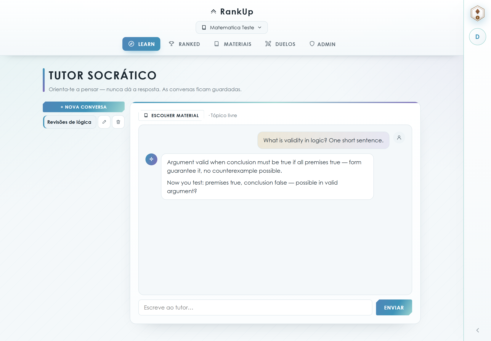
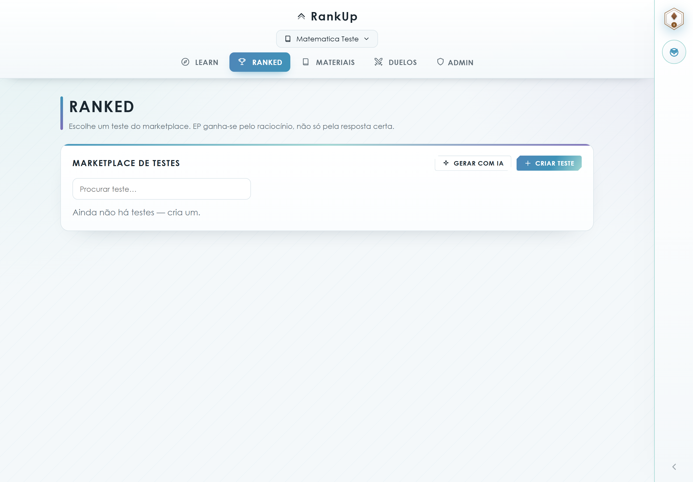
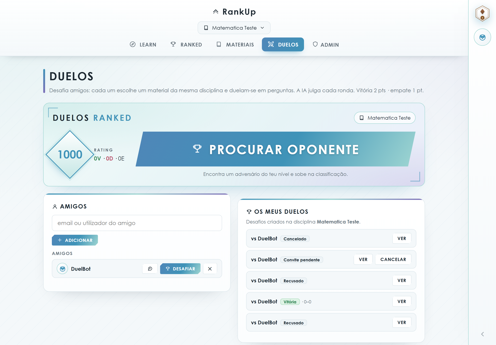
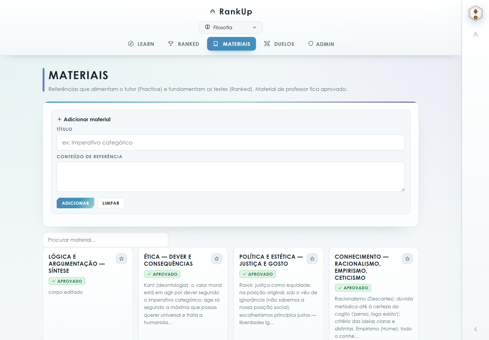
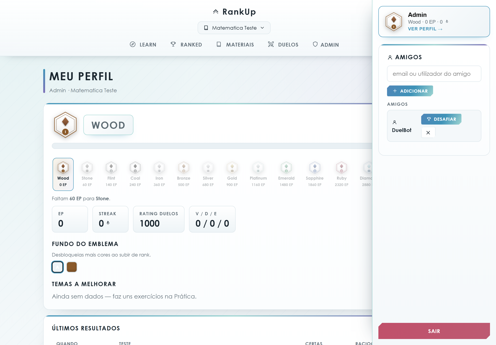
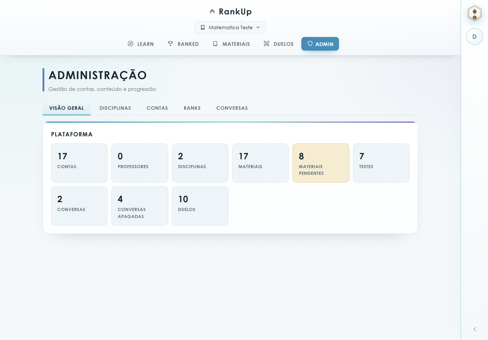

# RankUp

[](https://github.com/evolJoaoBento/RankUp/actions/workflows/ci.yml)

**Aprende a sério. Ranks que se conquistam.**

RankUp is a gamified learning platform for schools. Students study with an AI Socratic tutor, take ranked tests from a marketplace, duel friends in real-time question battles, and climb a Valorant-style rank ladder — from **Wood** to **Ascended** — by earning EP for *reasoning*, not just right answers.



## Features

### 🧠 Socratic AI Tutor
A chat tutor that never gives the answer — it guides the student towards it. Conversations are grounded in teacher-approved study materials, saved per subject, renamable in place, and recoverable for 6 months after deletion. Empty chats offer quick-start prompts.

### 🔁 A real learning loop
Getting a question wrong is where RankUp works hardest:

- Wrong MCQs **reveal the correct option and explain why** on the spot
- **Review mode** resurfaces the questions whose *latest* attempt was wrong (oldest gap first) — a banner on Learn and Ranked launches a 5-question review run
- Weak topics on the profile have a **one-click focused practice** button
- A **daily goal** ("Hoje: n/5") and correct-answer **streaks** keep the habit going

### 🏆 Ranked test marketplace
Teachers (or the AI) create tests; students take them and earn EP for their reasoning. Tests are linked to the materials that ground them, searchable, and show who submitted and who approved each one. Test runs shuffle question order per attempt, show a live progress bar and completion summary, and can be retaken in one click; every subject has an EP ladder that always shows your own position. Flashcard decks flip on click (or spacebar) with full keyboard navigation. Teachers can **print any test** as a paper sheet with an optional answer key.



### ⚔️ Duels
Two players pick one material each from the same discipline and take turns authoring questions (2 min) that both answer simultaneously (3 min). An AI judge picks the most correct answer each round — win 2 pts, draw 1 pt each. Includes:

- **Ranked matchmaking** with per-discipline Elo (K=32, chess-style) and a widening search window
- **Friend duels** — pick the discipline, challenge anyone on your friends list, rematch in one click
- Consequence-free cancel while the invite is pending (and a 3 s grace after accept)
- Coin-flip first turn, forfeit at any time, per-discipline leaderboard
- Exact "your turn" highlights, a red action counter on the nav, and a background sweeper that resolves abandoned duels



### 🧑‍🤝‍🧑 Community
Learning sticks better together — and everything social is **friends-only**, which keeps it school-safe:

- **Profiles with personality**: pick one of 16 line-art avatars (no uploads to moderate), change your display name and claim a unique username
- **Direct messages** between friends: chat threads with unread badges on the friends list and the account rail
- **Kudos** 👏: one sportsmanship clap per player after every duel, counted on the profile
- **Teacher announcements** 📣: per-discipline notices at the top of every student's Learn view
- **Friends system**: add by email/username, accept/decline, challenge to duels straight from the list
- **Achievements**: 12 badges (first answer → duel champion) computed live from real activity, with unlock toasts

### 📚 Materials
Study references that feed the tutor and ground the tests. Students can submit materials; teachers and admins approve them. Every material shows its author and approver.



### 📈 Progression & profile
Per-subject EP, rank badges with unlockable background colours, streaks, weak-topic detection, a 14-day EP chart, recent test results, achievements, kudos, duel history and per-discipline Elo record. Teachers get a class-wide weak-topic radar and per-test stats (attempts, students, % correct).



### 🌍 Localizable
The whole interface runs through a tiny i18n layer (`web/i18n.js`): the Portuguese source strings are the translation keys (gettext-style), so adding a language is **one dictionary** — missing entries safely fall back to Portuguese. English ships out of the box; users switch language on their profile (or it follows the browser). Ambiguous strings support `"texto|contexto"` disambiguation. The AI follows too: tutor replies and grading feedback are prompted in the student's language, and known API error messages translate in both directions.

### 🛠 Admin panel
Tabbed admin area with a platform-overview dashboard (accounts, pending materials, duels, …) and searchable table editors for accounts, disciplines (with SVG icon picker) and conversations (including soft-deleted chat recovery), plus AI usage metering per user.



## Architecture

```
backend/
├── src/mecateca/
│   ├── contexts/          # bounded contexts (modular monolith)
│   │   ├── identity/      # auth (JWT), roles, login throttling
│   │   ├── catalog/       # subjects, materials, tests, approval flow
│   │   ├── tutoring/      # Socratic chat (SSE streaming, soft delete)
│   │   ├── assessment/    # practice sessions, AI grading
│   │   ├── progression/   # EP, ranks, streaks, leaderboards
│   │   ├── metering/      # token usage + cost quotas
│   │   ├── social/        # friends + direct messages
│   │   └── duels/         # duel state machine, Elo, matchmaking, AI judge, kudos
│   ├── adapters/llm/      # pluggable LLM providers
│   └── main.py            # FastAPI app + advisory-locked startup migrations
├── web/                   # vanilla JS SPA (no build step)
├── alembic/               # migrations (additive, data-preserving)
└── packs/                 # subject content packs (YAML)
```

- **Stack:** FastAPI · SQLAlchemy 2 (async) · PostgreSQL 16 · Alembic · vanilla JS SPA (installable PWA with an offline app shell)
- **LLM backends** (`MECATECA_LLM_BACKEND`): `gateway` (OpenAI-compatible, e.g. a Claude Code gateway), `anthropic`, `ollama` (local), or `fake` (deterministic, for tests)
- Multi-instance safe: startup migrations serialized with a Postgres advisory lock; DB-backed rate limiting on login *and* registration (a successful login clears the shared-IP window, so a classroom NAT never locks out); atomic row-claims prevent double-judging duels; a background sweeper resolves abandoned duel deadlines
- Fully subject-agnostic — disciplines are created in the admin panel or imported as YAML packs; the Philosophy demo seed can be disabled (`MECATECA_SEED_DEMO=0`)

## Quick start

```bash
cd backend

# 1. Postgres
docker compose up -d db

# 2. Install
python -m venv .venv && . .venv/bin/activate   # Windows: .venv\Scripts\activate
pip install -e ".[dev]"
cp .env.example .env

# 3. Run (migrations + seed run on startup)
uvicorn mecateca.main:app --port 8080
```

Open http://localhost:8080 — the SPA is served by the backend. API docs at `/docs`.

Default LLM backend is `ollama`; set `MECATECA_LLM_BACKEND=gateway` and `MECATECA_GATEWAY_BASE_URL` to use an OpenAI-compatible gateway instead.

## Development

- `backend/tools/shots.py` — headless Playwright screenshots of every view (`python tools/shots.py`)
- `pytest` — runs against the `fake` LLM provider, no network needed
- Migrations: `alembic revision --autogenerate -m "..."` then restart the app (they apply on boot)
